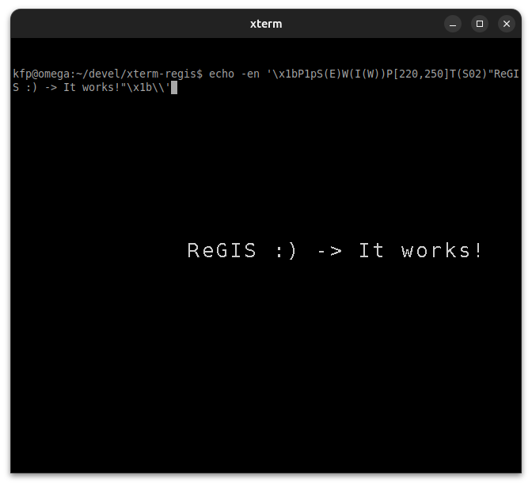

# xterm-regis

Xterm with ReGIS support enabled.

Citing from the VT330/VT340 Graphics Programming Manual[^1]:

ReGIS is a graphics instruction set from Digital[^2]. ReGIS provides a set of 
commands you can use to draw images on the screen.

*ReGIS, short for Remote Graphic Instruction Set*

Of course, those terminals are hardly in use today, however, there still are 
some terminal emulations that support ReGIS graphics. Besides some commercial 
ones, we are only aware of good old  **XTerm**, however, it must be compiled 
with `--enable-regis-graphics` contrary to **Sixel**[^3] support which is 
enabled by default. This is, however, no big deal (see below).

## More info about ReGIS
* https://en.wikipedia.org/wiki/ReGIS
* http://www.sizecoding.org/wiki/ReGIS
* https://vt100.net/docs/vt3xx-gp/chapter1.html
* https://en.wikipedia.org/wiki/VT320

## Compiling xterm with ReGIS support

    $ sudo apt install -y libxaw7-dev libncurses-dev libxft-dev
    $ git clone https://github.com/nilqed/xterm-regis.git
    $ cd xterm-regis
    $ ./configure --enable-regis-graphics
    $ make
    $ sudo make install
    

or getting latest `xterm` release from `invisible-island.net`:

    $ sudo apt install -y libxaw7-dev libncurses-dev libxft-dev
    $ wget https://invisible-island.net/datafiles/release/xterm.tar.gz
    $ tar xf xterm.tar.gz
    $ cd xterm-XXX   # where XXX=version-number
    $ ./configure --enable-regis-graphics
    $ make
    $ sudo make install

## Test

To test whether it works enter:

    $ echo -en '\x1bP1pS(E)W(I(W))P[220,250]T(S02)"ReGIS :) -> It works!"\x1b\\'

## Other configure options

There are some more useful options which can be configured.  

    $ ./configure --help 
    $ ## or
    $ ./configure --help | grep enable
    
provides a list.

## Customizing xterm

See .Xresources @ https://wiki.debian.org/Xresources and the links therein.

:date:

[^1]: http://bitsavers.trailing-edge.com/pdf/dec/terminal/vt340/EK-VT3XX-GP-001_VT330_VT340_Graphics_Programming_Mar87.pdf
[^2]: https://en.wikipedia.org/wiki/Digital_Equipment_Corporation
